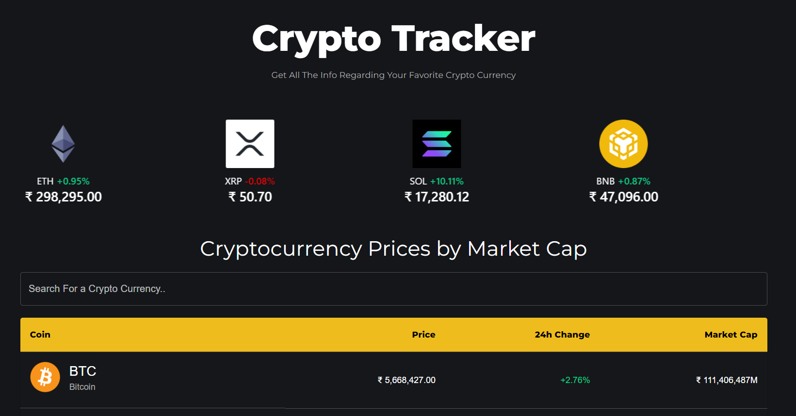

# Crypto Tracker

Crypto Tracker by React is a cutting-edge application built using the React framework, designed to provide real-time updates and insights into the volatile world of cryptocurrencies. With sleek design and intuitive user interface, users can effortlessly track their favorite digital assets, monitor prices, and analyze market trends with ease. Leveraging React's component-based architecture, the app offers seamless navigation and responsive performance across various devices. Whether you're a seasoned investor or a newcomer to the crypto space, Crypto Tracker by React empowers users to stay informed and make informed decisions in the fast-paced realm of cryptocurrency trading.

Click here for a <a target="_blank" href=""> DEMO </a>

## Setup

Clone the repository

```
$ git clone
```

```
$ npm run start
```

## Features

### React.js:

React.js is a JavaScript library for building user interfaces.
It utilizes a component-based architecture, allowing developers to create reusable UI components.
React.js efficiently updates the user interface by re-rendering only the necessary components when data changes, resulting in better performance.
Crypto Tracker utilizes React.js to create a dynamic and responsive user interface for tracking cryptocurrencies.

### Material-UI:

Material-UI is a React UI framework that implements Google's Material Design principles.
It provides a set of pre-designed and customizable UI components, such as buttons, cards, and grids.
Material-UI simplifies the development process by offering consistent and visually appealing design elements.
Crypto Tracker integrates Material-UI to ensure a modern and intuitive user interface, enhancing user experience and usability.

### Chart.js:

Chart.js is a JavaScript library for creating interactive and customizable charts.
It supports various chart types, including line charts, bar charts, and pie charts.
Chart.js enables developers to visualize complex data and trends effectively.
Crypto Tracker utilizes Chart.js to display real-time cryptocurrency data in visually appealing and informative charts, allowing users to analyze market trends and make informed decisions.


